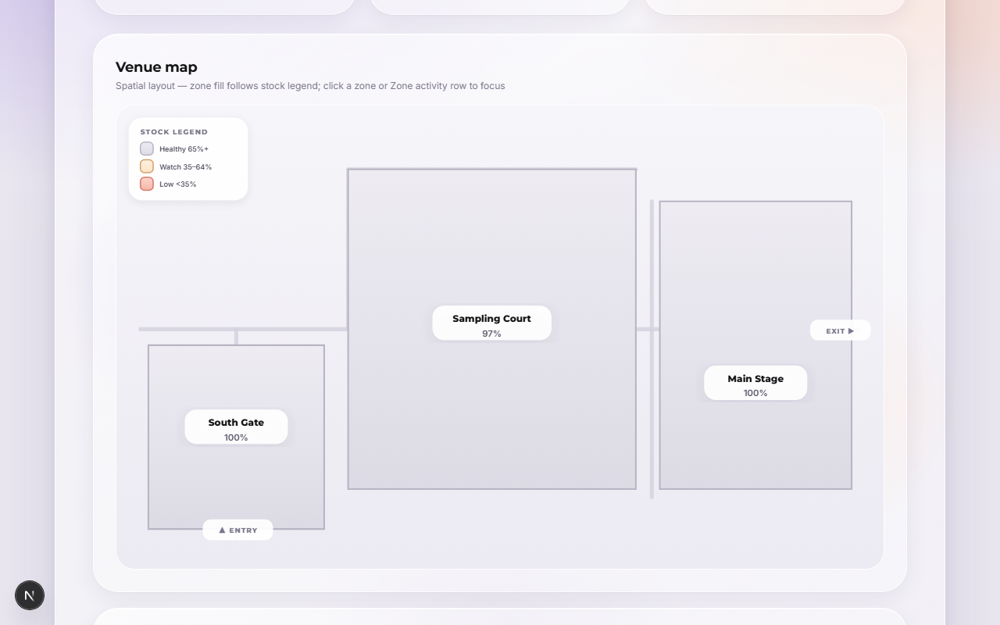
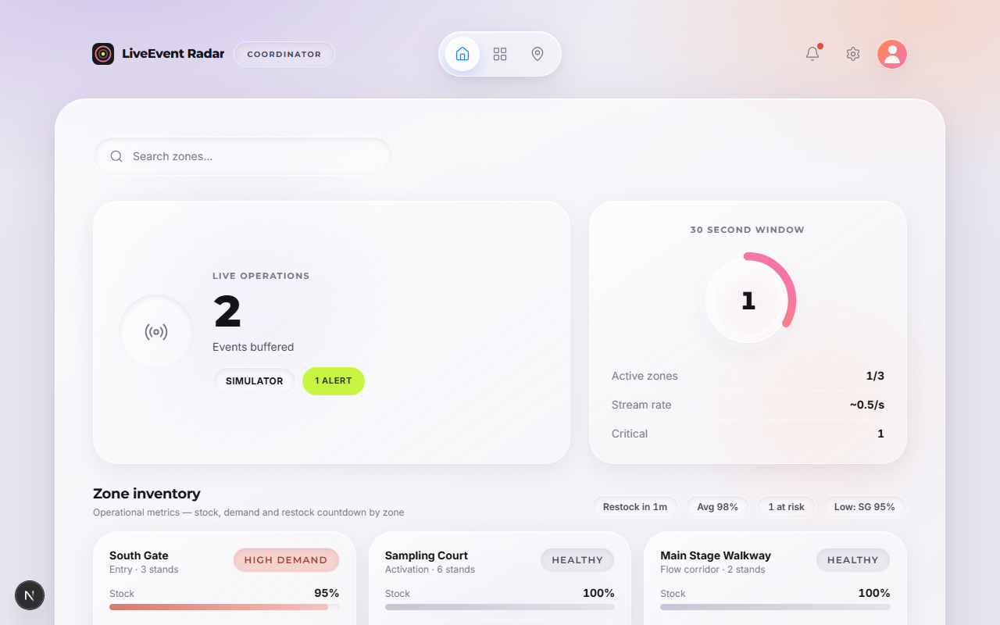
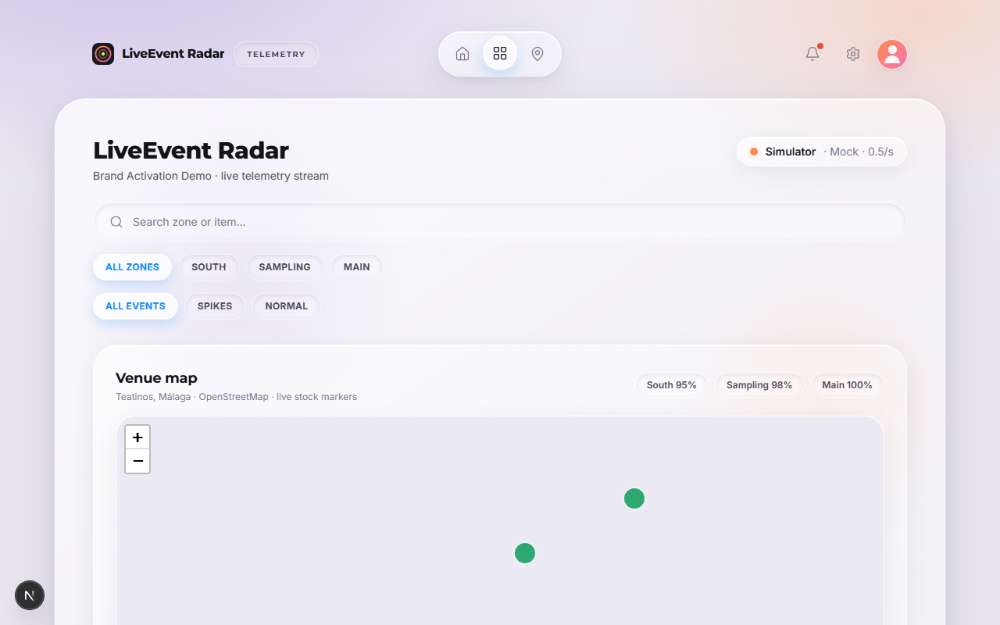

# LiveEvent Radar

[](https://live-event-radar.vercel.app)
[](https://ikrame-ih.github.io/live-event-radar/)

Front-end prototype for monitoring live telemetry during brand activations — zone stock, SKU movement, and event streams in the browser.

**Case study & architecture notes:** [ikrame-ih.github.io/live-event-radar](https://ikrame-ih.github.io/live-event-radar/)

<p align="center">
  
</p>

<p align="center">
  
</p>

<p align="center">
  <a href="https://github.com/ikrame-ih/live-event-radar/blob/main/docs/assets/readme/demo.mp4">
    
  </a>
</p>

<p align="center">
  <strong><a href="https://github.com/ikrame-ih/live-event-radar/blob/main/docs/assets/readme/demo.mp4">▶ Watch demo (MP4)</a></strong>
  — ~8s: Command Center KPIs + stock heat → <code>/dashboard</code> transition → live event stream
</p>

## Preview

<table>
  <tr>
    <td width="50%">
      
      <br />
      <sub><b>Command Center</b> — zone stock tiers, SVG map, synced activity rows</sub>
    </td>
    <td width="50%">
      
      <br />
      <sub><b>Telemetry</b> — Leaflet map (Teatinos), filters, capped FIFO stream</sub>
    </td>
  </tr>
</table>

## Screens

| Route            | Role                                                                                                      |
| ---------------- | --------------------------------------------------------------------------------------------------------- |
| **`/`**          | **Command Center** — KPIs, zone inventory, SVG venue map (stock heat), zone activity feed                 |
| **`/dashboard`** | **Telemetry** — Leaflet map (Teatinos, Málaga), filters, capped event stream, buffer KPI, Web Worker echo |

Both routes share one **Zustand** store (`telemetry-store`). Mock stream runs at ~0.5 events/s with spike bursts and single-zone crew restock every 60s. Optional **WebSocket** via env vars.

Navigation between routes uses a persistent shell (`AppShell`) and **View Transitions** crossfade (~180ms) via `TransitionLink`.

## Stack

Next.js 16 · React 19 · TypeScript · Tailwind CSS v4 · Zustand · Flowbite React · Lucide · Leaflet · Vitest · Playwright

## Quick start

```bash
npm install
npm run dev
```

Open [http://localhost:3000](http://localhost:3000) — Command Center at `/`, telemetry at `/dashboard`.

No environment variables are required for the mock demo.

## Scripts

| Command                    | Purpose                                           |
| -------------------------- | ------------------------------------------------- |
| `npm run dev`              | Development server                                |
| `npm run build`            | Production build                                  |
| `npm run start`            | Serve production build locally                    |
| `npm run lint`             | ESLint                                            |
| `npm run test`             | Vitest (watch)                                    |
| `npm run test:run`         | Vitest single run                                 |
| `npm run test:e2e`         | Playwright E2E — both routes, 3 viewports         |
| `npm run test:e2e:install` | Install Chromium for Playwright                   |
| `npm run capture:readme`   | Regenerate README hero PNGs + demo MP4 |
| `npm run docs:dev`         | VitePress docs site (local) |
| `npm run docs:build`       | Build docs for GitHub Pages |

## Pre-deploy checklist

```bash
npm run lint
npm run build
npm run test:run
npm run test:e2e
```

Last verified: **20** Vitest tests · **18** Playwright runs (6 specs × desktop / tablet / phone).

## Deploy on Vercel

1. Import [github.com/ikrame-ih/live-event-radar](https://github.com/ikrame-ih/live-event-radar) in Vercel.
2. **Framework preset:** Next.js — no custom root directory (this repo _is_ the app).
3. **Build command:** `npm run build` (default).
4. **Environment variables:** none required for the mock demo. Optional:
   - `NEXT_PUBLIC_SIMULATOR_ONLY=true` (default behaviour)
   - `NEXT_PUBLIC_WS_URL=wss://…` when a live feed exists
5. Smoke-test `/` and `/dashboard` on desktop and a narrow viewport after deploy.

## Environment (optional)

Copy `.env.example` to `.env.local` and restart `npm run dev` after changes.

| Variable                     | Purpose                                          |
| ---------------------------- | ------------------------------------------------ |
| `NEXT_PUBLIC_WS_URL`         | WebSocket endpoint; leave empty for mock-only    |
| `NEXT_PUBLIC_SIMULATOR_ONLY` | `true` = mock timer; `false` + URL = live socket |

`NEXT_PUBLIC_*` values are visible in the browser — never put secrets here.

## Project structure

```
app/
  layout.tsx               # Root layout (fonts, globals)
  (main)/
    layout.tsx             # Shared AppShell (header + background)
    page.tsx               # Command Center (/)
    dashboard/             # Telemetry route + components
  _components/
    app-shell.tsx          # Persistent chrome across routes
components/                # Shared UI (header, maps, sidebar, gauge, TransitionLink)
docs/                      # Public docs (VitePress) + README showcase assets
features/live-radar/
  hooks/                   # Simulator, WebSocket, worker, Command Center sync
  lib/                     # Zone stock, incidents, geo, labels
  mock/                    # Mock event generator
  state/                   # telemetry-store (Zustand)
  workers/                 # analytics.worker.ts
store/
  useEventStore.ts         # Incident + map selection state (/)
e2e/                       # Playwright specs + readme-showcase capture
```

## Data model (short)

- **Zones:** South Gate · Sampling Court · Main Stage Walkway
- **Buffer:** FIFO cap at 10,000 events in `telemetry-store`
- **Stock tiers:** Healthy ≥ 65% · Watch 35–64% · Low under 35%
- **Maps:** SVG schematic on `/` · Leaflet + OpenStreetMap on `/dashboard`

## Author

Ikrame Ibn Hayoun

## Repository

https://github.com/ikrame-ih/live-event-radar
