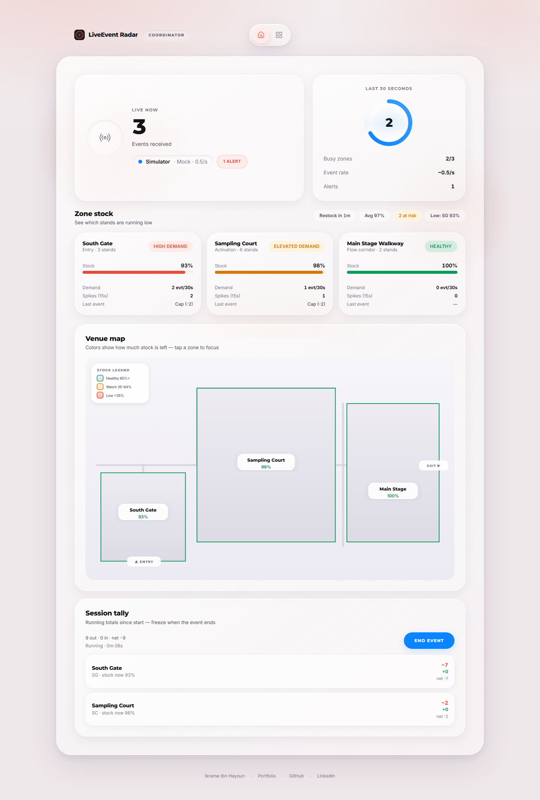
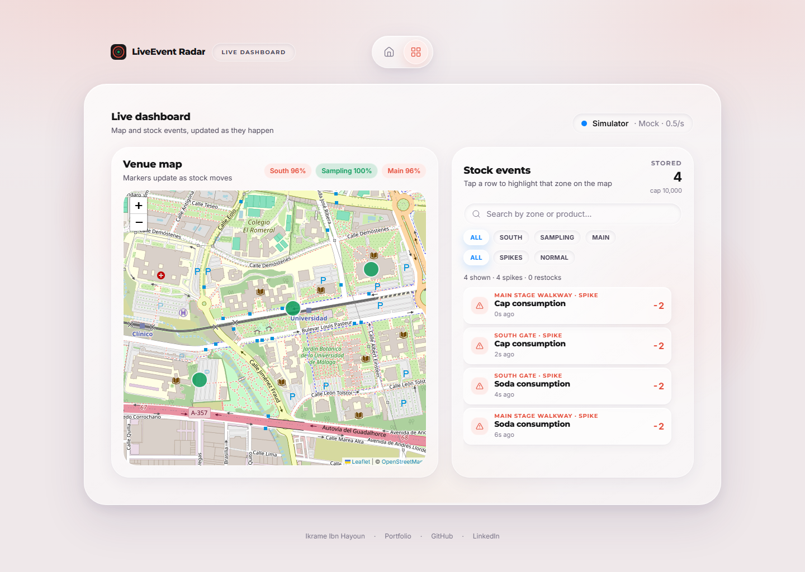

# LiveEvent Radar

[](https://github.com/ikrame-ih/live-event-radar/actions/workflows/ci.yml)
[](https://app.deepsource.com/gh/ikrame-ih/live-event-radar/)
[](https://live-event-radar.vercel.app)
[](https://ikrame-ih.github.io/live-event-radar/)

**Live operations dashboard for brand activations** — zone stock, venue maps, and a capped event stream in a glass UI Command Center.

Portfolio project (v0.1.0): frontend-only, mock stream by default, optional WebSocket feed. Two routes share one Zustand buffer.


|                               |                                                                                        |
| ----------------------------- | -------------------------------------------------------------------------------------- |
| **Live app**                  | [live-event-radar.vercel.app](https://live-event-radar.vercel.app)                     |
| **Documentation**             | [GitHub Pages docs](https://ikrame-ih.github.io/live-event-radar/)                     |
| **Source**                    | [github.com/ikrame-ih/live-event-radar](https://github.com/ikrame-ih/live-event-radar) |

## Highlights

- **Command Center (`/`)** — KPIs, zone inventory, SVG venue map with stock heat tiers, synced activity feed
- **Telemetry (`/dashboard`)** — Leaflet map, filters, capped event stream, buffer KPI, background worker
- **Shared state** — one Zustand store feeds both routes; incidents derived for the Command Center sidebar
- **Production-minded defaults** — FIFO buffer cap (10k events), strict TypeScript, ESLint, 24 unit tests, Playwright E2E

## Preview

<table>
  <tr>
    <td width="50%">
      
      <br /><sub><b>/</b> — Command Center</sub>
    </td>
    <td width="50%">
      
      <br /><sub><b>/dashboard</b> — Telemetry</sub>
    </td>
  </tr>
</table>

## Quick start

**Prerequisites:** Node.js 20+, npm.

```bash
git clone https://github.com/ikrame-ih/live-event-radar.git
cd live-event-radar
npm install
npm run dev
```

Open [http://localhost:3000](http://localhost:3000). No environment variables required for the mock demo.

## Scripts

| Command              | Purpose                             |
| -------------------- | ----------------------------------- |
| `npm run dev`        | Dev server                          |
| `npm run build`      | Production build                    |
| `npm run lint`       | ESLint                              |
| `npm run typecheck`  | TypeScript (`tsc --noEmit`)         |
| `npm run test:run`   | Vitest unit tests                   |
| `npm run test:e2e`   | Playwright (desktop, tablet, phone) |
| `npm run docs:build` | VitePress → GitHub Pages            |

**CI (every push/PR):** lint · typecheck · unit tests · build. **E2E (desktop)** runs on pushes to `main`. Docs deploy to GitHub Pages on `main`.

## Stack

Next.js 16 · React 19 · TypeScript · Tailwind v4 · Zustand · Leaflet · Vitest · Playwright

## Environment

Copy `.env.example` → `.env.local` when using a live WebSocket feed.

| Variable                     | Purpose                                          |
| ---------------------------- | ------------------------------------------------ |
| `NEXT_PUBLIC_WS_URL`         | WebSocket URL (`wss://…`); empty = mock only     |
| `NEXT_PUBLIC_SIMULATOR_ONLY` | `true` = mock timer; `false` + URL = live socket |

`NEXT_PUBLIC_*` is bundled in the browser — never put secrets there.

## Project layout

```
app/                  # Next.js routes + AppShell
components/           # Shared UI
features/live-radar/  # Stream, store, derivation, worker
store/                # Command Center incident selection
docs/                 # VitePress site + README assets
e2e/                  # Playwright specs
```

## Code quality

| Tool           | Role                                                       |
| -------------- | ---------------------------------------------------------- |
| **ESLint**     | Next.js core-web-vitals + TypeScript (local + CI)          |
| **DeepSource** | Static analysis on push/PR — bugs, security, anti-patterns |
| **Vitest**     | Unit tests for parsing, store, derivation                  |
| **Playwright** | Smoke tests across Command Center and dashboard            |

### DeepSource (how to run & read results)

[DeepSource](https://deepsource.com/) is a cloud static-analysis service (like a second pair of eyes on every commit). It is **not** the same as ESLint: it catches broader bug-risk and security patterns, tracks metrics, and posts a check on GitHub.

**One-time setup**

1. Sign in at [app.deepsource.com](https://app.deepsource.com/) with GitHub.
2. **Add repository** → select `ikrame-ih/live-event-radar`.
3. Ensure `.deepsource.toml` is on `main` (this repo includes it).
4. In **Settings → Code Review**, enable the **JavaScript** analyzer and code review.

**After each push**, open the DeepSource check on the commit or PR. Fix **blocking** issues in the Issues tab; ignore false positives via the dashboard or by updating `exclude_patterns` in `.deepsource.toml`.

**If analysis fails on metrics** (e.g. doc coverage on a small portfolio repo): **Settings → Metrics reporting** → lower thresholds or disable enforcement until you add coverage reporting. Code issues and metric gates are configured separately.

**If analysis fails on Minor anti-patterns** (e.g. `JS-0067` module-level constants in React — a known false positive): open **Settings → Issue reporting → Anti-pattern** and disable **Fail check** for **Minor** severity. Repeat for **Bug risk → Minor**. Alternatively, on the **Issues** tab: **Actions → Ignore this issue → For this repository** on `JS-0067`, `JS-R1005`, `JS-0415`, and `JS-0833`.

**If the message says “failing metrics”** (common on new repos with no coverage uploaded): open **Settings → Metrics reporting** and either disable **Fail check** for each metric, or lower thresholds to `0`. Also check the **Metrics** tab on the dashboard — a red metric tile blocks the check even when all code issues are ignored.

**Local CLI (optional):** install from [DeepSource CLI releases](https://github.com/deepsourcecorp/cli/releases), then run `deepsource report --analyzer test-coverage` after generating coverage. Most workflow is dashboard-driven; CI uses the GitHub app automatically.

## Documentation

- [Technical decisions](https://ikrame-ih.github.io/live-event-radar/technical-decisions)
- [Architecture](https://ikrame-ih.github.io/live-event-radar/architecture)
- [Data pipeline](https://ikrame-ih.github.io/live-event-radar/pipeline)

## License

MIT — see [LICENSE](./LICENSE). Vulnerability reports: [SECURITY.md](./SECURITY.md).

## Author

**Ikrame Ibn Hayoun** — [Portfolio](https://ikrame-ih.vercel.app/) · [GitHub](https://github.com/ikrame-ih) · [LinkedIn](https://www.linkedin.com/in/ikrame-ih/)
