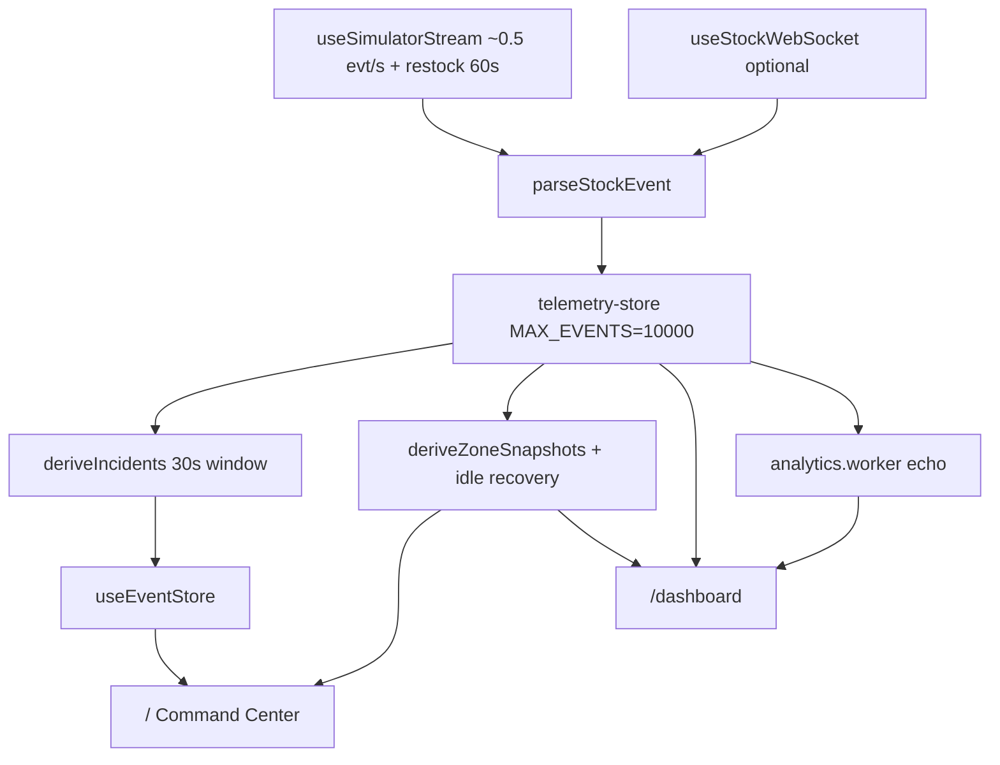

# Architecture & stack

## One-liner

The browser receives mock (or optional WebSocket) stock events, stores them in a capped rolling list via Zustand, optionally summarizes in a Web Worker, then renders **two UIs**: Command Center at `/` (SVG map + incidents) and telemetry at `/dashboard` (Leaflet map + filtered event stream).

## Current data path



**Scope:** two routes, one shared store. No auth. WebSocket optional with connection badge in the UI.

## Event shape

```json
{
  "zone": "South Gate",
  "item": "Soda",
  "quantity": -1,
  "timestamp": 1718540000000
}
```

Zones: `South Gate`, `Sampling Court`, `Main Stage Walkway`.  
Items: `Soda`, `Cap`, `Sample bag`. Negative quantity = consumption.

## Technology roster

| Technology | Role |
| ---------- | ---- |
| Next.js 16 | App Router, routing, layout |
| React 19 | UI components |
| TypeScript | `StockEvent` typing |
| Tailwind CSS v4 | Layout, responsive |
| Zustand | `telemetry-store`, `useEventStore` |
| Web Workers | Analytics echo on `/dashboard` |
| React SVG | Schematic map on `/` |
| Leaflet | Geographic map on `/dashboard` |
| Vitest + Playwright | Unit + E2E |

## Per-message flow

1. Parse typed `StockEvent`
2. Push into Zustand via `appendEvent`
3. Trim when length passes 10,000 (FIFO)
4. Derive incidents + zone snapshots
5. Views read selectors and repaint

## Project evolution {#project-evolution}

### Phase A — Original MVP

| Aspect | State |
| ------ | ----- |
| Route | `/` redirected → `/dashboard` |
| Layout | 4-panel grid |
| Map | Canvas 2D heatmap |
| Zones | Entrance A, North stand, Main stage |

### Phase B — UI iteration

Zone rename to venue-realistic labels. Asymmetric venue plan. Map-dominant layout.

### Phase C — Command Center

| Addition | Detail |
| -------- | ------ |
| Route | `/` is primary (no redirect) |
| Map | `InteractiveMap.tsx` — React SVG |
| State | `useEventStore` + `deriveIncidents` bridge |
| Interaction | Sidebar ↔ map selection |

### Phase D — UI + telemetry redesign (Jun 2026)

Glass design system, Leaflet on `/dashboard`, `deriveZoneSnapshots` stock model, Zone inventory + activity split.

### Phase E — macOS polish (Jun 2026)

`app/(main)/` route group, persistent `AppShell`, `TransitionLink` + View Transitions API, macOS active states.

### Phase F — Public docs (Jun 2026)

Portfolio case study + curated architecture notes published via GitHub Pages (this site). README hero PNG showcase.

### Phase G — Recruiter polish (Jun 2026)

Technical decisions page, WebSocket connection badge, animated buffer KPI (rAF), gauge scan accent, a11y pass on stream and filters.

## Which route to demo

| Screen | Purpose |
| ------ | ------- |
| `/` | First impression — shell UI, KPIs, stock heat |
| `/dashboard` | Technical depth — Leaflet, filters, FIFO stream |

Both share `telemetry-store` and the same mock stream.

Related: [Technical decisions](/technical-decisions) · [Current state](/current-state) · [Pipeline](/pipeline)
