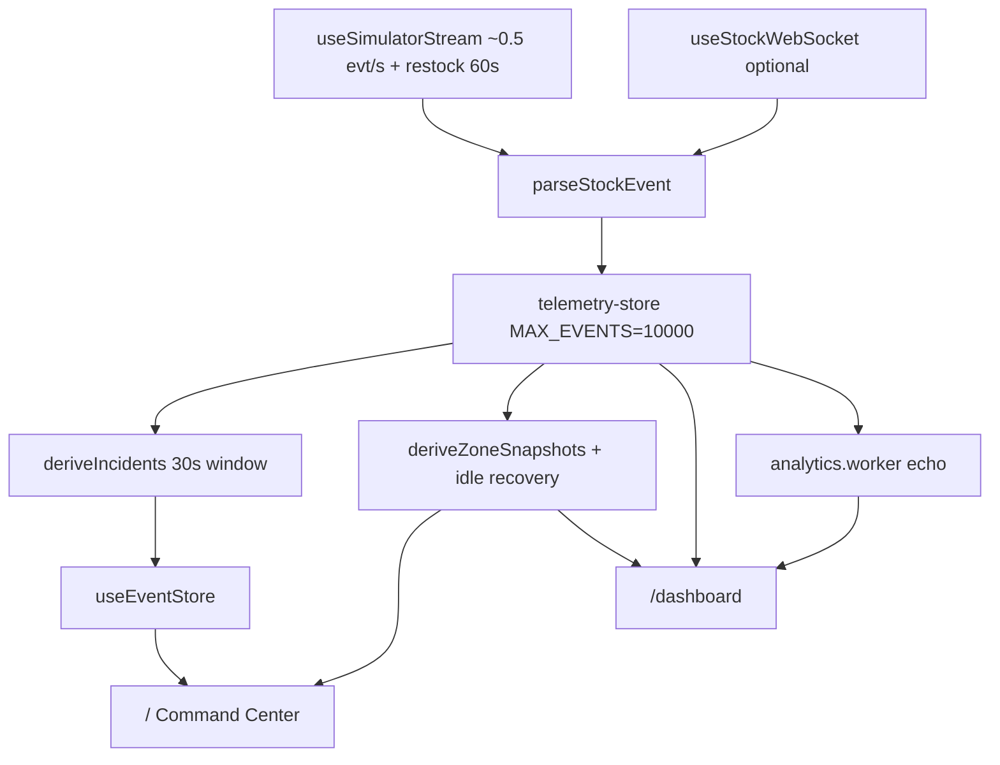

# Architecture & stack

## What it does

The browser receives stock events (from a mock timer or an optional WebSocket), stores them in a rolling list via Zustand (a state management library), optionally processes summaries in a background Web Worker thread, then renders **two screens**: the Command Center at `/` (SVG venue map + incidents) and the Telemetry view at `/dashboard` (Leaflet map + filtered event stream).

## Current data path

The diagram below shows how data moves from source to screen:



**Scope:** two routes, one shared store. No authentication. WebSocket is optional — a connection badge in the UI reflects the current state.

## Event shape

Every stock change in the system is represented as a single JSON object:

```json
{
  "zone": "South Gate",
  "item": "Soda",
  "quantity": -1,
  "timestamp": 1718540000000
}
```

Zones: `South Gate`, `Sampling Court`, `Main Stage Walkway`.  
Items: `Soda`, `Cap`, `Sample bag`. A negative quantity means consumption (stock going down).

## Technology roster

| Technology | Role |
| ---------- | ---- |
| Next.js 16 | App Router, file-based routing, persistent layout |
| React 19 | UI components |
| TypeScript | Strict `StockEvent` typing across the codebase |
| Tailwind CSS v4 | Layout and responsive styles |
| Zustand | Shared `telemetry-store` and `useEventStore` — lightweight state management |
| Web Workers | Analytics summaries computed off the main browser thread on `/dashboard` |
| React SVG | Schematic venue map on `/` |
| Leaflet | Geographic map with real tiles on `/dashboard` |
| Vitest + Playwright | Unit tests + end-to-end browser tests |

## Per-message flow

Every event from any source follows this path:

1. Parse into a typed `StockEvent`
2. Push into Zustand via `appendEvent`
3. Drop the oldest entry if the buffer exceeds 10,000 events (FIFO — first in, first out)
4. Derive incidents and zone stock snapshots from the updated buffer
5. Both views read from selectors and re-render what changed

## Project evolution {#project-evolution}

### Phase A — Original MVP

| Aspect | State |
| ------ | ----- |
| Route | `/` redirected → `/dashboard` |
| Layout | 4-panel grid |
| Map | Canvas 2D heatmap |
| Zones | Entrance A, North stand, Main stage |

### Phase B — UI iteration

Zone names updated to venue-realistic labels. Asymmetric venue plan. Layout shifted to map-dominant.

### Phase C — Command Center

| Addition | Detail |
| -------- | ------ |
| Route | `/` becomes the primary screen (no redirect) |
| Map | `InteractiveMap.tsx` — React SVG |
| State | `useEventStore` + `deriveIncidents` bridge |
| Interaction | Sidebar ↔ map zone selection |

### Phase D — UI + telemetry redesign (Jun 2026)

Glass design system, Leaflet on `/dashboard`, `deriveZoneSnapshots` stock model, Zone inventory and activity split.

### Phase E — macOS polish (Jun 2026)

`app/(main)/` route group, persistent `AppShell` (header and background stay mounted between navigations), `TransitionLink` with the View Transitions API, macOS-style active states.

### Phase F — Public docs (Jun 2026)

Portfolio case study and architecture notes published as a static site via GitHub Pages. README hero PNG showcase.

### Phase G — Recruiter polish (Jun 2026)

Technical decisions page, WebSocket connection badge, animated buffer KPI using `requestAnimationFrame`, gauge scan accent, accessibility pass on stream and filters.

## Which route to demo

| Screen | Purpose |
| ------ | ------- |
| `/` | First impression — shell UI, KPIs, stock heat map |
| `/dashboard` | Technical depth — Leaflet, filters, capped FIFO stream |

Both routes share `telemetry-store` and the same mock stream — any event that appears on one screen is reflected on the other.

Related: [Technical decisions](/technical-decisions) · [Current state](/current-state) · [Pipeline](/pipeline)
