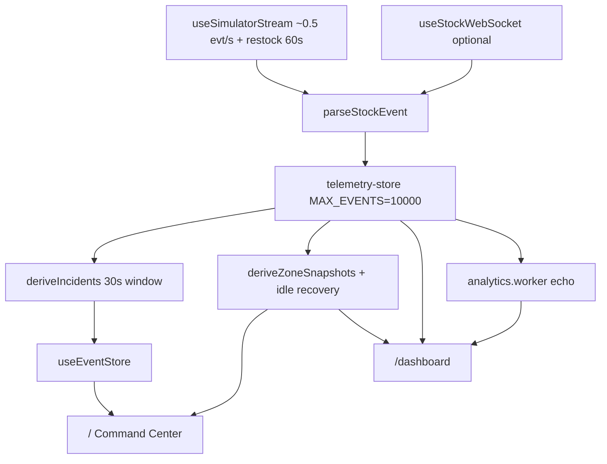

# Architecture & stack

## What it does

The browser receives stock events (mock timer or optional WebSocket), stores them in a rolling Zustand buffer, optionally runs lightweight summaries in a Web Worker, and renders **two screens**: the Command Center at `/` (SVG venue map + incidents) and Telemetry at `/dashboard` (Leaflet map + filtered event stream).

## Data path



Two routes, one shared store. No auth. WebSocket is optional — the connection badge reflects whatever feed is active.

## Event shape

```json
{
  "zone": "South Gate",
  "item": "Soda",
  "quantity": -1,
  "timestamp": 1718540000000
}
```

Zones: `South Gate`, `Sampling Court`, `Main Stage Walkway`.  
Items: `Soda`, `Cap`, `Sample bag`. Negative quantity = consumption.

## Stack

Next.js 16 (App Router) · React 19 · TypeScript · Tailwind v4 · Zustand · Web Workers · React SVG + Leaflet · Vitest + Playwright

Each event follows the same path: parse → `appendEvent` → trim at 10,000 (oldest dropped first) → derive incidents and zone snapshots → both views re-render from selectors.

## How the project grew

The first version was a single `/dashboard` route with a 4-panel grid and a Canvas 2D heatmap. Zone names were generic (`Entrance A`, `North stand`). Fine for a spike, but not what I wanted to show recruiters.

I renamed zones to venue-realistic labels, shifted to a map-dominant layout, and added `/` as the primary Command Center — SVG map, incident sidebar, `useEventStore` bridged from `deriveIncidents`. `/dashboard` stayed for telemetry depth.

In June 2026 I did a full UI pass: glass shell, Leaflet on `/dashboard`, `deriveZoneSnapshots` for stock tiers, zone inventory cards split from the activity feed. Then macOS-style nav active states, a persistent `AppShell`, and `TransitionLink` with View Transitions (~180ms crossfade) so route changes don't flash the header.

Docs went public on GitHub Pages around the same time. The last round was practical polish — connection badge, animated buffer KPI, accessibility on the stream and filters.

## Which route to demo

Start at `/` for the shell UI and stock heat map. Use `/dashboard` when you want Leaflet, filters, and the capped FIFO stream. Both read the same `telemetry-store`, so events stay in sync.

Related: [Technical decisions](/technical-decisions) · [Current state](/current-state) · [Pipeline](/pipeline)
