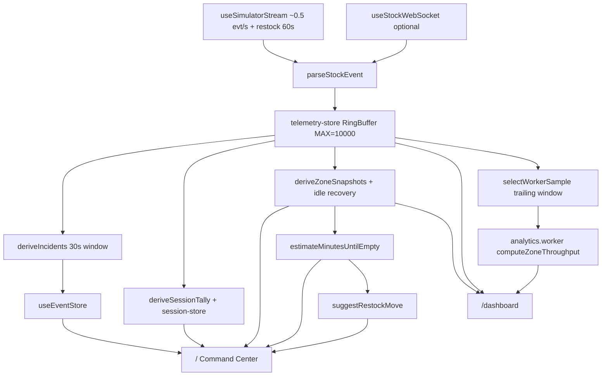

# Architecture & stack

## What it does

The browser receives stock events (mock timer or optional WebSocket), stores them in a capped Zustand-backed **ring buffer**, derives zone snapshots / session tally / ETA on the main thread, and offloads **windowed throughput + hotspot** math to a Web Worker. Two screens share the same buffer: Command Center at `/` and Live dashboard at `/dashboard`.

## Ring buffer — plain language

A ring buffer is a fixed-size list that wraps around. Picture 10,000 seats in a circle: when they are full, the next event sits in the oldest seat and that older event is gone. Memory stays bounded for a whole shift, append stays cheap, and operators still see the recent flow they act on. The React store materializes an immutable snapshot of those seats when something publishes — so the ring itself is O(1) to write, while subscribers pay O(n) once per update.

## Data path


```mermaid
flowchart TB
  mock["useSimulatorStream ~0.5 evt/s + restock 60s"]
  ws["useStockWebSocket optional"]
  parse["parseStockEvent"]
  telemetry["telemetry-store RingBuffer MAX=10000"]
  incidents["deriveIncidents 30s window"]
  tally["deriveSessionTally + session-store"]
  stock["deriveZoneSnapshots + idle recovery"]
  eta["estimateMinutesUntilEmpty"]
  suggest["suggestRestockMove"]
  eventStore["useEventStore"]
  sample["selectWorkerSample trailing window"]
  worker["analytics.worker computeZoneThroughput"]
  cmd["/ Command Center"]
  dash["/dashboard"]

  mock --> parse --> telemetry
  ws --> parse
  telemetry --> incidents --> eventStore --> cmd
  telemetry --> tally --> cmd
  telemetry --> stock --> cmd
  stock --> eta --> cmd
  eta --> suggest --> cmd
  telemetry --> dash
  stock --> dash
  telemetry --> sample --> worker --> dash
```

Session tally uses `session-store` (`startedAt` / `endedAt`) so End event freezes totals while the live map can keep updating. No auth. WebSocket is optional — the connection badge reflects whatever feed is active.

## Routes (current)

| Route | Purpose |
| ----- | ------- |
| `/` | Command Center — KPIs, zone stock + ETA, suggestion, SVG map, Session tally (Copy / CSV) |
| `/dashboard` | Live dashboard — Leaflet map, filters, scrolling stock events, Worker throughput panel |

Both share ring-buffered `telemetry-store`. Layout lives under `app/(main)/` with a persistent `AppShell`.

## Event shape

```json
{
  "zone": "South Gate",
  "item": "Soda",
  "quantity": -1,
  "timestamp": 1718540000000
}
```

Zones: `South Gate`, `Sampling Court`, `Main Stage Walkway`.  
Items: `Soda`, `Cap`, `Sample bag`. Negative quantity = consumption.

## Stock model

Map fill follows three bands — Healthy (≥ 65%, teal), Watch (35–64%, amber), Low (< 35%, coral). **Minutes to empty** uses the last ~60s consumption pace (heuristic). Session tally freezes with End event; handoff text includes ETA + optional suggested move.

The mock simulator seeds ~3 minutes of backdated history on first load so Watch/Low tiers and ETA are visible immediately, then continues at ~0.5 evt/s with a crew restock every 60s.

## Stack

Next.js 16 (App Router) · React 19 · TypeScript · Tailwind v4 · Zustand · Web Workers · React SVG + Leaflet · Vitest + Playwright

## How the project grew

The first version was a single `/dashboard` route with a 4-panel grid and a Canvas 2D heatmap. Zone names were generic. Fine for a spike, not for a demo people would actually explore.

Later: venue-realistic zones, Command Center at `/`, glass UI, Leaflet, Session tally, then a deeper frontend pass — worker sample for throughput, ring buffer, Minutes-to-empty + restock hint, CSV/handoff, tighter CI.

## Key files

**Shell:** `app/_components/app-shell.tsx`, `components/AppHeader.tsx`, `TransitionLink.tsx`, `ConnectionStatusBadge.tsx`, `AnimatedBufferCount.tsx`

**Command Center (`/`):** zone stock + ETA, `OpsSuggestionBanner`, `InteractiveMap`, `SessionTallyPanel`

**Live dashboard (`/dashboard`):** `WorkerThroughputPanel`, Leaflet map, event stream

**Ingest & analytics:** `ring-buffer.ts`, `telemetry-store.ts`, `use-live-feed.ts`, `use-now.ts`, `use-analytics-worker.ts`, `analytics.worker.ts`, `estimate-minutes-until-empty.ts`, `suggest-restock.ts`

## Tests & CI

| Command | Role |
| ------- | ---- |
| `npm run test:run` | Vitest unit |
| `npm run test:coverage` | Vitest + lcov (uploaded in CI) |
| `npm run bench` | Ring append harness |
| `npm run test:e2e` | Playwright (3 viewports local; desktop in CI) |

Docs deploy to GitHub Pages on push to `main`. Live app: [live-event-radar.vercel.app](https://live-event-radar.vercel.app).

## Which route to demo

Start at `/` for ETA, suggestion, and Session tally handoff. Use `/dashboard` for Leaflet + worker throughput. Both read the same `telemetry-store`.

More detail in [Decisions & challenges](/decisions) · [Pipeline](/pipeline) · [Benchmarks](/benchmarks)
