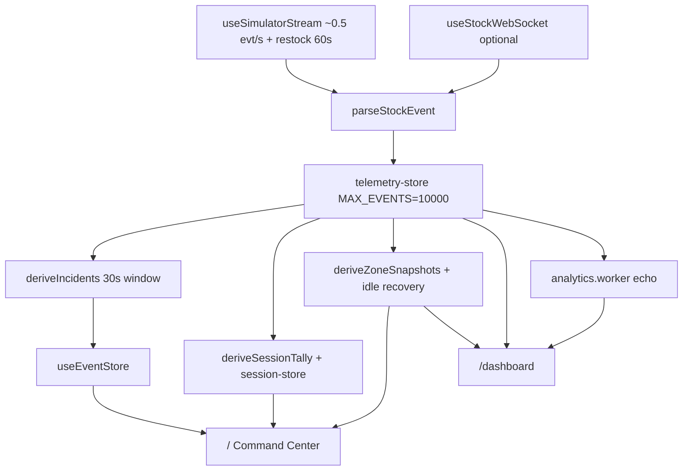

# Architecture & stack

## What it does

The browser receives stock events (mock timer or optional WebSocket), stores them in a rolling Zustand buffer, optionally runs lightweight summaries in a Web Worker, and renders **two screens**: the Command Center at `/` (SVG venue map + Session tally) and the Live dashboard at `/dashboard` (Leaflet map + filtered stock events).

## Data path


```mermaid
flowchart TB
  mock["useSimulatorStream ~0.5 evt/s + restock 60s"]
  ws["useStockWebSocket optional"]
  parse["parseStockEvent"]
  telemetry["telemetry-store MAX_EVENTS=10000"]
  incidents["deriveIncidents 30s window"]
  tally["deriveSessionTally + session-store"]
  stock["deriveZoneSnapshots + idle recovery"]
  eventStore["useEventStore"]
  worker["analytics.worker echo"]
  cmd["/ Command Center"]
  dash["/dashboard"]

  mock --> parse --> telemetry
  ws --> parse
  telemetry --> incidents --> eventStore --> cmd
  telemetry --> tally --> cmd
  telemetry --> stock
  stock --> cmd
  telemetry --> dash
  stock --> dash
  telemetry --> worker --> dash
```

Two routes, one shared event buffer. Session tally uses `session-store` (`startedAt` / `endedAt`) so End event freezes totals while the live map can keep updating. No auth. WebSocket is optional — the connection badge reflects whatever feed is active.

## Event shape

```json
{
  "zone": "South Gate",
  "item": "Soda",
  "quantity": -1,
  "timestamp": 1718540000000
}
```

Zones: `South Gate`, `Sampling Court`, `Main Stage Walkway`.  
Items: `Soda`, `Cap`, `Sample bag`. Negative quantity = consumption.

## Stack

Next.js 16 (App Router) · React 19 · TypeScript · Tailwind v4 · Zustand · Web Workers · React SVG + Leaflet · Vitest + Playwright

Each event follows the same path: parse → `appendEvent` → trim at 10,000 (oldest dropped first) → derive incidents and zone snapshots → both views re-render from selectors.

## How the project grew

The first version was a single `/dashboard` route with a 4-panel grid and a Canvas 2D heatmap. Zone names were generic (`Entrance A`, `North stand`). Fine for a spike, but not what I wanted to show recruiters.

I renamed zones to venue-realistic labels, shifted to a map-dominant layout, and added `/` as the primary Command Center — SVG map, incident sidebar, `useEventStore` bridged from `deriveIncidents`. `/dashboard` stayed for telemetry depth.

In June 2026 I did a full UI pass: glass shell, Leaflet on `/dashboard`, `deriveZoneSnapshots` for stock tiers, zone stock cards split from the activity feed. Then a persistent `AppShell`, `TransitionLink` with View Transitions (~180ms crossfade), coral ambient/nav polish, typography utilities, a compact Live dashboard split (map | capped scrolling stock events), friendlier section copy, a two-icon header nav (Command Center · Live dashboard), and Session tally (End event freeze) replacing the old activity feed UI — `deriveIncidents` remains for map anchors. Stock events select by event key so only one row highlights.

Docs went public on GitHub Pages around the same time (Pages redeploy **only on push to `main`**). The last round was practical polish — connection badge, animated buffer KPI, accessibility on the stream and filters.

## Which route to demo

Start at `/` for the shell UI, stock heat map, and Session tally. Use `/dashboard` when you want the Live dashboard — Leaflet, filters, and the capped FIFO stock-events list. Both read the same `telemetry-store`, so events stay in sync.

Related: [Technical decisions](/technical-decisions) · [Current state](/current-state) · [Pipeline](/pipeline)
