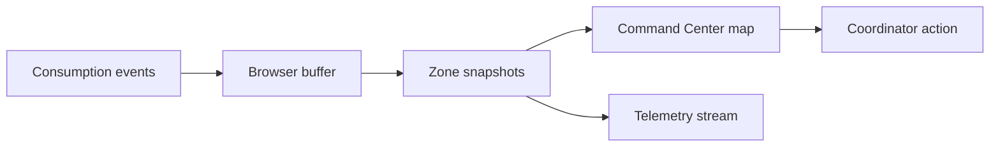

# Business problem & ROI

## The concrete problem

Working big promotions as a brand hostess / promoter, the operational pain was **high latency information**. A busy stand might run out of drinks or merch mid-afternoon, but central coordinators often do not know until hours later — after queues formed and sales were missed.

Today that usually happens through WhatsApps, calls, or manual counts. There is no single live picture of which stands are draining stock fastest.

## Operational impact

1. **Stock-outs** — empty counters, frustrated guests, lost revenue.
2. **Mismatched stock** — one stand holds excess inventory while another runs dry, with no mid-event rebalance.

## How the product addresses it

A coordinator opens a tablet. On a simplified venue heatmap, a zone flashes warning with copy along the lines of:

> *High consumption: this stand may run empty in roughly X minutes (estimate).*

The prediction does not need to be perfect on day one. The win is UX that feels like **real ops telemetry** — nudging action before the visible gap.

## What I built (frontend scope)

This project demonstrates how real-time frontend engineering can reduce coordination latency during a live promotion:

- A **Next.js app** fed by consecutive events (mocked locally or streamed)
- **State** that survives rapid updates without melting (Zustand with FIFO cap at 10,000 events)
- A **zone heatmap, alerts, KPIs, and event stream** that stay usable when bursts hit

**Two screens:**

| Route | Role |
| ----- | ---- |
| `/` | Digital Command Center — SVG venue map, zone inventory, activity feed |
| `/dashboard` | Telemetry depth — Leaflet map, filters, capped event stream |

## ROI framing

| Stakeholder lens | Value |
| ---------------- | ----- |
| Brand / ops | Faster awareness of stock pressure per zone |
| Field teams | One dashboard instead of scattered messages |
| Engineering demo | Proof of capped buffers, derived state, and dual-surface maps in the browser |

## Workflow

Next: [Architecture](/architecture) · [Data pipeline](/pipeline)
