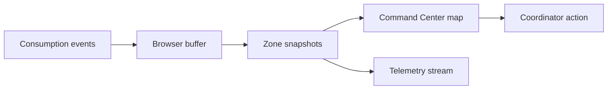

# Business problem & ROI

## The concrete problem

Working big promotions as a brand hostess, the operational pain was always the same: **information arriving too late**. A busy stand might run out of drinks or merch mid-afternoon, but central coordinators only hear about it hours later — through WhatsApp or manual head counts. There is no single live picture of which zones are draining stock fastest.

That leads to visible stock-outs (empty counters, frustrated guests) and mismatched inventory — one stand holding excess while another runs dry, with no way to rebalance mid-event.

## How the product addresses it

A coordinator opens a tablet. On a simplified venue heat map, a zone flashes a warning with something like:

> *High consumption: this stand may run empty in roughly X minutes (estimate).*

The prediction doesn't need to be perfect on day one. The value is a UI that feels like **real ops telemetry** — nudging action before the gap becomes visible to guests.

## What I built (frontend scope)

A **Next.js app** fed by consecutive events (mocked locally or streamed via WebSocket), with state that handles rapid updates without crashing — Zustand and a FIFO buffer capped at 10,000 events.

Two screens:

| Route | Role |
| ----- | ---- |
| `/` | Digital Command Center — SVG venue map, zone inventory, activity feed |
| `/dashboard` | Telemetry depth — Leaflet map, filters, capped event stream |

For ops teams that's faster awareness per zone and one dashboard instead of scattered messages. As an engineering demo it shows capped buffers, derived state, and dual-surface maps running entirely in the browser.

Next: [Architecture](/architecture) · [Data pipeline](/pipeline)
