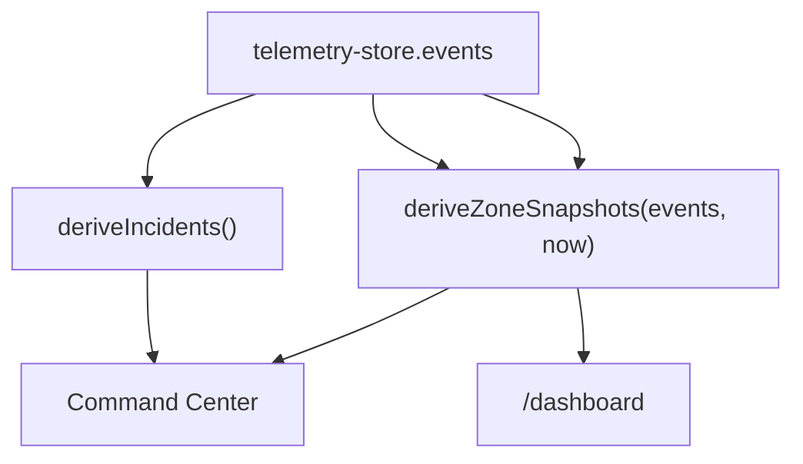

# Client-side data pipeline

## Goal

Prove the browser can ingest **heavy-feeling realtime-style traffic** responsibly — capped memory, derived summaries, smooth UI thread.

## Current modules (Jun 2026)

| Module | Path | Role |
| ------ | ---- | ---- |
| Simulator | `hooks/use-simulator-stream.ts` | ~0.5 evt/s + 60s restock pulse |
| WebSocket | `hooks/use-stock-websocket.ts` | Optional live feed |
| Command Center sync | `hooks/use-command-center-sync.ts` | `deriveIncidents` → `useEventStore` |
| Zone stock | `lib/zone-stock.ts` | Stock %, tiers, idle recovery |
| Mock generator | `mock/mock-event-generator.ts` | Spike-heavy consumption |
| Store | `state/telemetry-store.ts` | FIFO cap 10,000 events |
| Worker | `hooks/use-analytics-worker.ts` | Echo on `/dashboard` |

## Event type

```typescript
export type StockEvent = {
  zone: string;
  item: string;
  quantity: number; // negative = consumption
  timestamp: number;
};
```

## Zustand store pattern

```typescript
const MAX_EVENTS = 10_000;

function trimEvents(events: StockEvent[], next: StockEvent): StockEvent[] {
  const merged = [...events, next];
  return merged.length > MAX_EVENTS
    ? merged.slice(merged.length - MAX_EVENTS)
    : merged;
}
```

Every event passes through the same `appendEvent()` path — simulator, WebSocket, or future API.

## Simulator balance

| Parameter | Value |
| --------- | ----- |
| Tick interval | 2000 ms (~0.5 events/s) |
| Consumption | 32% spikes (−3/−5), rest −1/−2 |
| Crew restock | One random zone every 60s, +10–21 |
| Idle recovery | After 40s quiet, +1%/s toward 100% |

Tuned so stock colour changes appear within ~30–60 seconds in a quick demo run.

## Derivation layer



- **`deriveIncidents`** — per-zone rollups, 30s window → `useEventStore`
- **`deriveZoneSnapshots`** — stock %, demand, heat tier for both maps

## WebSocket hook (optional)

`useStockWebSocket(url)` connects when `NEXT_PUBLIC_WS_URL` is set and `NEXT_PUBLIC_SIMULATOR_ONLY` is not `true`. Parsed events call the same `appendEvent`.

## Web Worker

`analytics.worker.ts` receives lightweight summaries. The `/dashboard` route mounts `useAnalyticsWorker` and exposes an sr-only echo for E2E verification.

## Stability checklist

- All events through `appendEvent()`
- `MAX_EVENTS` prevents unbounded growth
- `useEffect` cleanup on intervals, sockets, timers
- Workers exchange summaries, not full event arrays

Related: [Architecture](/architecture) · [Current state](/current-state)
