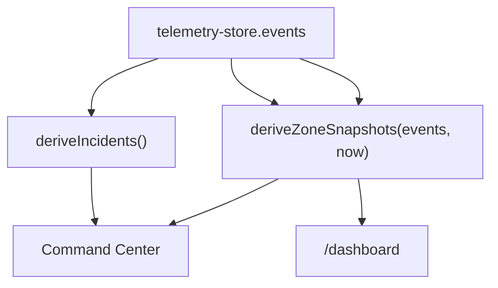

# Client-side data pipeline

Goal: handle a continuous stock event stream without unbounded memory, UI jank, or a blocked main thread.

## Modules

| Module | Path | Role |
| ------ | ---- | ---- |
| Simulator | `hooks/use-simulator-stream.ts` | ~0.5 events/s, spike bursts, crew restock every 60s |
| WebSocket | `hooks/use-stock-websocket.ts` | Live feed when `NEXT_PUBLIC_WS_URL` is set |
| Command Center sync | `hooks/use-command-center-sync.ts` | Derives incidents → `useEventStore` for `/` |
| Zone stock | `lib/zone-stock.ts` | Stock %, tier, idle recovery |
| Mock generator | `mock/mock-event-generator.ts` | Spike-heavy consumption patterns |
| Store | `state/telemetry-store.ts` | FIFO buffer, cap 10,000 |
| Worker | `hooks/use-analytics-worker.ts` | Lightweight summaries on `/dashboard` |

## Event type

```typescript
export type StockEvent = {
  zone: string;
  item: string;
  quantity: number; // negative = consumption
  timestamp: number;
};
```

## Store

Everything enters through `appendEvent`. When the buffer passes 10,000 events, the oldest row is dropped:

```typescript
const MAX_EVENTS = 10_000;

function trimEvents(events: StockEvent[], next: StockEvent): StockEvent[] {
  const merged = [...events, next];
  return merged.length > MAX_EVENTS
    ? merged.slice(merged.length - MAX_EVENTS)
    : merged;
}
```

Same entry point for simulator, WebSocket, or a future API.

## Simulator tuning

Built so stock tiers become visible within a short demo:

- Tick every 2000 ms (~0.5/s)
- 32% of ticks are spikes (−3 or −5); rest −1 or −2
- One random zone restocked every 60s (+10–21 units)
- After 40s idle, a zone recovers +1%/s toward 100%

## Derivation

Raw events aren't rendered directly. Two functions compute what the UI needs:



- **`deriveIncidents`** — groups by zone over 30s, pushes summaries into `useEventStore`
- **`deriveZoneSnapshots`** — stock %, demand trend, heat tier for both maps

## WebSocket

`useStockWebSocket(url)` connects when `NEXT_PUBLIC_WS_URL` is set and `NEXT_PUBLIC_SIMULATOR_ONLY` isn't `true`. Parsed events call the same `appendEvent`.

## Web Worker

`analytics.worker.ts` currently echoes lightweight summaries — enough to prove `postMessage` works before heavier math. The main thread never sends the full 10,000-event buffer across the thread boundary; that would defeat the cap.

Effect cleanups stop intervals, close sockets, and terminate workers on unmount.

Related: [Architecture](/architecture) · [Current state](/current-state)
