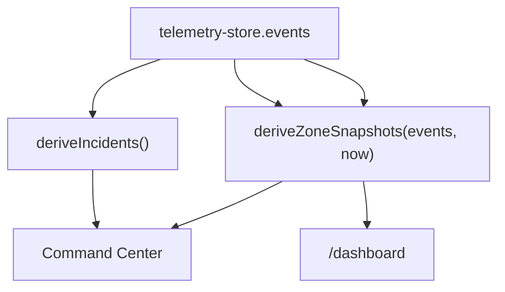

# Client-side data pipeline

## Goal

Show that the browser can handle a continuous stream of stock events responsibly — without unbounded memory growth, jank in the UI, or a collapsed main thread.

## Current modules (Jun 2026)

| Module | Path | Role |
| ------ | ---- | ---- |
| Simulator | `hooks/use-simulator-stream.ts` | Fires ~0.5 events/s with spike bursts and a crew restock every 60s |
| WebSocket | `hooks/use-stock-websocket.ts` | Optional live feed when `NEXT_PUBLIC_WS_URL` is set |
| Command Center sync | `hooks/use-command-center-sync.ts` | Computes incidents and pushes them to `useEventStore` for the `/` route |
| Zone stock | `lib/zone-stock.ts` | Calculates stock percentage, tier (Healthy / Watch / Low), and idle recovery |
| Mock generator | `mock/mock-event-generator.ts` | Generates spike-heavy consumption patterns |
| Store | `state/telemetry-store.ts` | FIFO buffer capped at 10,000 events |
| Worker | `hooks/use-analytics-worker.ts` | Sends lightweight summaries to a background thread on `/dashboard` |

## Event type

Every stock change is a single typed record:

```typescript
export type StockEvent = {
  zone: string;
  item: string;
  quantity: number; // negative = consumption
  timestamp: number;
};
```

## Zustand store pattern

Zustand is a minimal state library. The store holds the event buffer and trims it when it grows past the cap:

```typescript
const MAX_EVENTS = 10_000;

function trimEvents(events: StockEvent[], next: StockEvent): StockEvent[] {
  const merged = [...events, next];
  return merged.length > MAX_EVENTS
    ? merged.slice(merged.length - MAX_EVENTS)
    : merged;
}
```

This is the FIFO (first in, first out) cap in action: when the list is full, the oldest event is dropped to make room for the new one. Every event passes through the same `appendEvent()` entry point — simulator, WebSocket, or a future API.

## Simulator balance

The simulator is tuned so stock changes become visible within a short demo session:

| Parameter | Value |
| --------- | ----- |
| Tick interval | 2000 ms (~0.5 events/s) |
| Consumption | 32% of ticks are spikes (−3 or −5 units); rest are −1 or −2 |
| Crew restock | One random zone every 60s, +10–21 units |
| Idle recovery | After 40s with no activity, a zone recovers +1%/s back toward 100% |

## Derivation layer

Raw events are never rendered directly. Two functions compute the values the UI actually needs:



- **`deriveIncidents`** — groups events by zone over a 30-second window and pushes summaries into `useEventStore` for the Command Center
- **`deriveZoneSnapshots`** — calculates the current stock percentage, demand trend, and heat tier for both venue maps

## WebSocket hook (optional)

`useStockWebSocket(url)` connects when `NEXT_PUBLIC_WS_URL` is set and `NEXT_PUBLIC_SIMULATOR_ONLY` is not `true`. Parsed events call the same `appendEvent` so the rest of the pipeline is identical to the simulator path.

## Web Worker

`analytics.worker.ts` runs in a separate browser thread. It receives lightweight event summaries — not the full buffer — and echoes them back for the E2E test to verify. Sending the whole 10,000-event array would defeat the purpose of keeping the main thread free.

## Stability checklist

- All events enter through `appendEvent()` — one path regardless of source
- `MAX_EVENTS` keeps memory bounded regardless of how long the session runs
- `useEffect` cleanups stop intervals, close sockets, and cancel timers when a component unmounts
- Workers exchange summaries only, keeping cross-thread message payloads small

Related: [Architecture](/architecture) · [Current state](/current-state)
