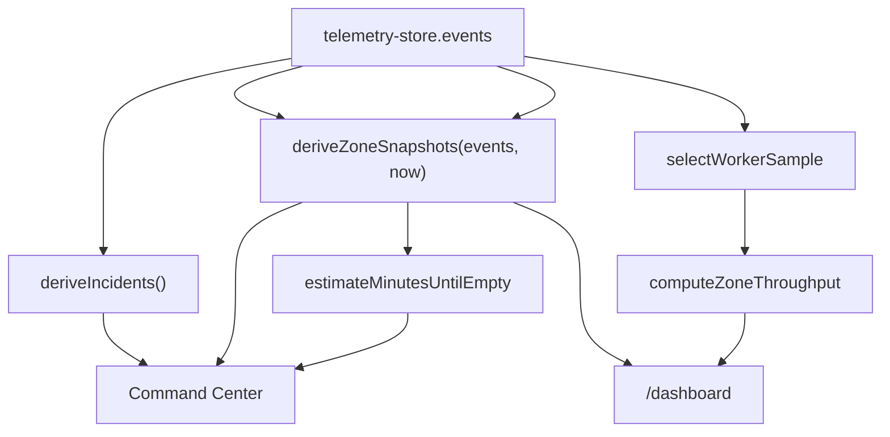

# Client-side data pipeline

Goal: handle a continuous stock event stream without unbounded memory, UI jank, or cloning the entire buffer into a Worker.

## Modules

| Module | Path | Role |
| ------------------- | ---------------------------------- | --------------------------------------------------- |
| Simulator | `hooks/use-simulator-stream.ts` | ~0.5 events/s, spike bursts, crew restock every 60s |
| WebSocket | `hooks/use-stock-websocket.ts` | Live feed when `NEXT_PUBLIC_WS_URL` is set |
| Command Center sync | `hooks/use-command-center-sync.ts` | Derives incidents → `useEventStore` for `/` |
| Zone stock | `lib/zone-stock.ts` | Stock %, tier, idle recovery |
| ETA | `lib/estimate-minutes-until-empty.ts` | Heuristic minutes-to-empty from recent pace |
| Restock hint | `lib/suggest-restock.ts` | Single donor→needy suggestion |
| Mock generator | `mock/mock-event-generator.ts` | Spike-heavy consumption patterns |
| Ring buffer | `lib/ring-buffer.ts` | O(1) capped FIFO slots |
| Store | `state/telemetry-store.ts` | Publishes immutable snapshots from the ring |
| Throughput | `lib/zone-throughput.ts` | Pure aggregation used by tests + worker |
| Worker hook | `hooks/use-analytics-worker.ts` | Debounced sample → Worker → hotspot summary |
| Worker | `workers/analytics.worker.ts` | Off-thread `computeZoneThroughput` |

## Event type

```typescript
export type StockEvent = {
  zone: string;
  item: string;
  quantity: number; // negative = consumption
  timestamp: number;
};
```

## Store

Everything enters through `appendEvent` / `appendEvents`. The module-level `RingBuffer` owns mutable slots; Zustand stores `{ events, revision }` snapshots for React:

```typescript
const MAX_EVENTS = 10_000;
// ring.push is O(1); toArray() materializes oldest→newest for subscribers
```

Same entry point for simulator, WebSocket, or a future API.

## Simulator tuning

Built so stock tiers become visible within a short demo:

- Tick every 2000 ms (~0.5/s)
- 32% of ticks are spikes (−3 or −5); rest −1 or −2
- One random zone restocked every 60s (+10–21 units)
- After 40s idle, a zone recovers +1%/s toward 100%

## Derivation


```mermaid
flowchart TB
  events["telemetry-store.events"]
  incidents["deriveIncidents()"]
  snapshots["deriveZoneSnapshots(events, now)"]
  eta["estimateMinutesUntilEmpty"]
  sample["selectWorkerSample"]
  worker["computeZoneThroughput"]
  cmd["Command Center"]
  dash["/dashboard"]

  events --> incidents --> cmd
  events --> snapshots --> cmd
  snapshots --> eta --> cmd
  events --> snapshots --> dash
  events --> sample --> worker --> dash
```

- **`deriveIncidents`** — groups by zone over 30s for map anchors
- **`deriveZoneSnapshots`** — stock %, demand trend, heat tier
- **`estimateMinutesUntilEmpty`** — decision aid (documented heuristic limits)
- **Worker** — relative hotspots from a trailing window sample only

## WebSocket

`useStockWebSocket(url)` connects when `NEXT_PUBLIC_WS_URL` is set and `NEXT_PUBLIC_SIMULATOR_ONLY` isn't `true`. Parsed events call the same `appendEvent`.

## Web Worker

Runs windowed throughput / hotspot math off the main thread:

1. Main thread builds a trailing sample via `selectWorkerSample` (time window + hard cap).
2. Worker runs `computeZoneThroughput` and returns rates / hotspot flags.
3. `/dashboard` renders **Zone throughput**.

Effect cleanups stop intervals, close sockets, and terminate the worker on unmount.

See also [Architecture](/architecture) and [Benchmarks](/benchmarks).
